# PodAgent OS — System Architecture

> **Status**: Draft
> **Last Updated**: 2026-02-25
> **Author**: Architect Agent

## 1. System Overview

PodAgent OS is a modular, AI-powered podcast production pipeline that takes raw multi-track audio recordings and produces mastered, tagged, publishable episodes. It operates as a **4-stage sequential pipeline** with human review gates between each stage.

The system follows a **non-destructive, resumable, human-in-the-loop** design philosophy. Source audio is never modified directly — all edits are expressed as decision lists (EDLs). Every automated decision is reviewable and overridable. If the pipeline fails at any stage, it can resume from the last completed checkpoint.


**Core invariants:**
- The **project manifest** (`manifest.yaml`) is the single source of truth for every episode's state
- Every module reads its inputs from well-defined paths and writes outputs to well-defined paths
- No module has knowledge of another module's internals — they communicate only through file artifacts and the manifest

> [REVIEW] **Gap**: No gate after Module 4 (Mastering). The pipeline goes straight to "Published Episode" with no final human review. A producer should be able to listen to the mastered MP3 in a format that is easily editable. The file should be in a format that it can be imported into a free editing softare (Audacity, Reaper or similar) and verify the story, loudness/metadata before it's considered "published." Consider adding a Gate 4 or at minimum a final confirmation step.

---

## 2. Module Architecture

### 2.1 Module 1: Ingestion & Context Mapping

**Purpose**: Accept raw audio files, transcribe them, identify speakers, align multi-track recordings, and produce a structured context document that downstream modules can reason over.

**Inputs:**
| Input | Format | Required |
|-------|--------|----------|
| Raw audio tracks (1–N) | WAV, FLAC, or MP3 | Yes |
| Episode metadata | YAML (title, date, participants) | Yes |
| Speaker profiles | YAML (name, role, voice sample ref) | Optional |

**Outputs:**
| Output | Format | Description |
|--------|--------|-------------|
| Transcript | JSON (word-level, with timestamps and speaker IDs) | Full transcript with word-level timing |
| Alignment map | JSON | Maps multi-track files to a common timeline |
| Context document | JSON | Structured episode context: topics mentioned, proper nouns, key segments |
| Module checkpoint | Written to manifest | Marks ingestion as complete |

**Key operations:**
1. Validate and catalog input audio files (duration, sample rate, channels, format)
2. Transcribe each track using speech-to-text (Whisper) with word-level timestamps
3. Perform speaker diarization — assign speaker IDs to transcript segments
4. Align multi-track files to a shared timeline via waveform cross-correlation
5. Run LLM analysis (Claude) on the transcript to produce the context document — identifying topics, proper nouns, segment boundaries, and a rough structural outline
6. Write all outputs and update the manifest

**Boundary**: This module knows nothing about editing decisions. It produces raw, structured data for Module 2 to act on.

---

### 2.2 Module 2: Narrative & Content Editing

**Purpose**: Analyze the transcript and context document to produce an Edit Decision List (EDL) — a non-destructive set of instructions describing what to cut, rearrange, or flag for review.

**Inputs:**
| Input | Format | Required |
|-------|--------|----------|
| Transcript | JSON (from Module 1) | Yes |
| Context document | JSON (from Module 1) | Yes |
| Alignment map | JSON (from Module 1) | Yes |
| Editing config | YAML (sensitivity thresholds, style preferences) | Optional |

**Outputs:**
| Output | Format | Description |
|--------|--------|-------------|
| Edit Decision List | EDL (CMX 3600) + JSON sidecar | Non-destructive edit instructions |
| Edit rationale log | JSON | Why each edit was proposed (for human review) |
| Content summary | Markdown | Episode summary, chapter markers, key quotes |
| Module checkpoint | Written to manifest | Marks editing as complete |

**Key operations:**
1. **Filler & dead air removal**: Detect "um", "uh", repeated false starts, and extended silences. Produce cut points in the EDL.
2. **Tangent detection**: Use LLM (Claude) to identify off-topic digressions based on the context document. Flag these with confidence scores — high-confidence tangents are auto-marked for cut, low-confidence are flagged for human review.
3. **Structural editing**: Identify intro, main segments, and outro. Propose segment reordering if it improves narrative flow (always flagged for human approval).
4. **Chapter marker generation**: Use the context document to propose chapter titles and timestamps.
5. **Show notes draft**: Generate episode summary, key timestamps, and links mentioned.
6. Write EDL and all outputs, update manifest.

**Boundary**: This module does not touch audio. It outputs text-based editing instructions only. The EDL is the contract between editing and mixing.

---

### 2.3 Module 3: Audio Processing & Mixing

**Purpose**: Apply the EDL from Module 2 to the source audio — executing cuts, applying audio processing (noise reduction, leveling, ducking), and producing a mixed-down audio file.

**Inputs:**
| Input | Format | Required |
|-------|--------|----------|
| Raw audio tracks | WAV/FLAC (original source files) | Yes |
| Edit Decision List | EDL (CMX 3600) + JSON sidecar | Yes |
| Alignment map | JSON (from Module 1) | Yes |
| Mixing config | YAML (target loudness, ducking settings, noise reduction level) | Optional |

**Outputs:**
| Output | Format | Description |
|--------|--------|-------------|
| Mixed audio | WAV (48kHz/24bit) | Full mix with edits applied |
| Mixing log | JSON | Processing steps applied, parameters used |
| Waveform preview | PNG | Visual overview for human review |
| Module checkpoint | Written to manifest | Marks mixing as complete |

**Key operations:**
1. **EDL execution**: Parse the EDL and apply all cut/keep/rearrange decisions to the source audio, producing a new timeline.
2. **Per-track processing**:
   - Noise reduction (via pluggable provider: local FFmpeg filters, Auphonic, or Dolby.io)
   - Dynamic range compression per speaker to even out volume
   - De-essing if configured
3. **Multi-track mixing**:
   - Auto-ducking: lower background/secondary tracks when the primary speaker is talking
   - Crossfade generation at edit points (configurable duration, default 50ms)
   - Intro/outro music bed insertion if provided
4. **Mix-down**: Combine all processed tracks into a single stereo WAV file.
5. Write outputs, update manifest.

**Boundary**: This module does not make editorial decisions — it faithfully executes the EDL. It does not normalize for distribution loudness; that's Module 4's job.

---

### 2.4 Module 4: Mastering & Publishing Delivery

**Purpose**: Take the mixed audio and produce final, distribution-ready files — loudness-normalized, true-peak limited, encoded in target formats, and tagged with metadata.

**Inputs:**
| Input | Format | Required |
|-------|--------|----------|
| Mixed audio | WAV (from Module 3) | Yes |
| Content summary | Markdown (from Module 2) | Yes |
| Episode metadata | YAML (from manifest) | Yes |
| Mastering config | YAML (target LUFS, formats, cover art path) | Optional |

**Outputs:**
| Output | Format | Description |
|--------|--------|-------------|
| Mastered audio (broadcast) | MP3 (192kbps CBR, -16 LUFS) | Podcast distribution format |
| Mastered audio (archive) | WAV (48kHz/24bit, -16 LUFS) | Lossless archive master |
| Episode metadata file | JSON | Complete ID3/metadata for embedding |
| Show notes | Markdown + HTML | Formatted for podcast hosting platforms |
| Publishing package | ZIP or directory | All deliverables bundled for upload |
| Module checkpoint | Written to manifest | Marks mastering as complete |

**Key operations:**
1. **Loudness normalization**: Measure integrated loudness (LUFS) and normalize to target (-16 LUFS for podcasts, configurable).
2. **True-peak limiting**: Ensure no inter-sample peaks exceed -1 dBTP.
3. **Encoding**: Produce MP3 (LAME, 192kbps CBR) and optionally WAV/FLAC archive copies.

> [REVIEW] **Update from research**: Loudness normalization MUST use FFmpeg two-pass linear mode (`loudnorm` with `measured_*` params and `linear=true`). Single-pass mode causes audible pumping/breathing artifacts. Set `LRA=11` to avoid unwanted dynamic range compression on speech. See `docs/research-p0.md` Section 3.
4. **Metadata embedding**: Write ID3v2 tags — title, artist, album (show name), episode number, cover art, chapter markers.
5. **Show notes finalization**: Format the content summary from Module 2 into platform-ready show notes (Markdown + HTML).
6. **Package assembly**: Bundle all deliverables into a publishing-ready directory.
7. Write outputs, update manifest with final status.

**Boundary**: This module does not re-edit or re-mix. It takes a finished mix and prepares it for the world.

---

## 3. Pipeline Flow

```mermaid
flowchart TD
    subgraph Input
        RAW[Raw Audio Tracks]
        META[Episode Metadata YAML]
    end

    subgraph "Module 1: Ingestion & Context Mapping"
        I1[Validate & catalog audio files]
        I2[Transcribe with word-level timestamps]
        I3[Speaker diarization]
        I4[Multi-track alignment]
        I5[LLM context extraction]
    end

    subgraph G1[Gate 1: Review Transcript & Context]
        G1R{Human Review}
    end

    subgraph "Module 2: Narrative & Content Editing"
        E1[Filler & dead air detection]
        E2[Tangent detection via LLM]
        E3[Structural editing proposals]
        E4[Chapter markers & show notes]
        E5[Generate EDL]
    end

    subgraph G2[Gate 2: Review Edit Decisions]
        G2R{Human Review}
    end

    subgraph "Module 3: Audio Processing & Mixing"
        X1[Execute EDL on source audio]
        X2[Per-track noise reduction & compression]
        X3[Auto-ducking & crossfades]
        X4[Mix-down to stereo WAV]
    end

    subgraph G3[Gate 3: Review Mix]
        G3R{Human Review}
    end

    subgraph "Module 4: Mastering & Publishing"
        P1[Loudness normalization -16 LUFS]
        P2[True-peak limiting]
        P3[Encode MP3 + WAV]
        P4[Embed metadata & cover art]
        P5[Assemble publishing package]
    end

    RAW --> I1
    META --> I1
    I1 --> I2 --> I3 --> I4 --> I5
    I5 --> G1R
    G1R -->|Approved| E1
    G1R -->|Rejected / Modified| I5
    E1 --> E2 --> E3 --> E4 --> E5
    E5 --> G2R
    G2R -->|Approved| X1
    G2R -->|Rejected / Modified| E1
    X1 --> X2 --> X3 --> X4
    X4 --> G3R
    G3R -->|Approved| P1
    G3R -->|Rejected / Modified| X1
    P1 --> P2 --> P3 --> P4 --> P5
    P5 --> DONE[Published Episode]
```



**File formats flowing between modules:**

| Boundary | Files Passed | Format |
|----------|-------------|--------|
| Input → Module 1 | Raw audio, metadata | WAV/FLAC/MP3, YAML |
| Module 1 → Module 2 | Transcript, alignment map, context doc | JSON |
| Module 2 → Module 3 | EDL, alignment map, source audio refs | CMX 3600 + JSON sidecar |
| Module 3 → Module 4 | Mixed audio, content summary | WAV, Markdown |

> [REVIEW] **Gap**: The Module 2 → Module 3 boundary passes "source audio refs" but this isn't listed in Module 2's outputs (Section 2.2). Module 3 needs the original audio tracks (from the `tracks/` directory), plus the alignment map (from Module 1), plus the EDL (from Module 2). The alignment map is a Module 1 output that Module 3 consumes directly — it skips Module 2. This cross-module dependency should be documented explicitly. Currently Module 3's inputs table lists it, but the flow diagram doesn't show this path.

---

## 4. Project Manifest Schema

The manifest is the single source of truth. Every module reads and writes to it. It lives at `<project-root>/manifest.yaml`.

```yaml
# manifest.yaml — Episode Project Manifest
version: "1.0"
project:
  name: "My Podcast"
  episode_number: 42
  title: "The One About Architecture"
  recording_date: "2026-02-20"
  participants:
    - name: "Alice"
      role: host
      track: "tracks/alice.wav"
    - name: "Bob"
      role: guest
      track: "tracks/bob.wav"

files:
  source_tracks:
    - path: "tracks/alice.wav"
      duration_seconds: 3842.5
      sample_rate: 48000
      channels: 1
      format: "wav"
    - path: "tracks/bob.wav"
      duration_seconds: 3840.1
      sample_rate: 48000
      channels: 1
      format: "wav"
  transcript: "artifacts/ingestion/transcript.json"
  alignment_map: "artifacts/ingestion/alignment.json"
  context_document: "artifacts/ingestion/context.json"
  edl: "artifacts/editing/edit-list.edl"
  edl_sidecar: "artifacts/editing/edit-list.json"
  edit_rationale: "artifacts/editing/rationale.json"
  content_summary: "artifacts/editing/summary.md"
  mixed_audio: "artifacts/mixing/mixed.wav"
  mastered_mp3: "artifacts/mastering/episode.mp3"
  mastered_wav: "artifacts/mastering/episode.wav"
  show_notes: "artifacts/mastering/show-notes.md"

pipeline:
  current_stage: "editing"  # ingestion | editing | mixing | mastering | complete
  stages:
    ingestion:
      status: "completed"       # pending | in_progress | completed | failed
      started_at: "2026-02-25T10:00:00Z"
      completed_at: "2026-02-25T10:12:34Z"
      gate_approved: true
      gate_approved_at: "2026-02-25T10:15:00Z"
      gate_notes: "Transcript looks good. Fixed speaker ID for Bob in segment 3."
    editing:
      status: "in_progress"
      started_at: "2026-02-25T10:16:00Z"
      completed_at: null
      gate_approved: null
      gate_approved_at: null
      gate_notes: null
    mixing:
      status: "pending"
      started_at: null
      completed_at: null
      gate_approved: null
      gate_approved_at: null
      gate_notes: null
    mastering:
      status: "pending"
      started_at: null
      completed_at: null
      gate_approved: null
      gate_approved_at: null
      gate_notes: null

config:
  editing:
    filler_sensitivity: 0.7          # 0.0–1.0, higher = more aggressive
    tangent_sensitivity: 0.5         # 0.0–1.0
    min_silence_duration_ms: 800     # silences shorter than this are kept
  mixing:
    target_loudness_lufs: -16
    crossfade_duration_ms: 50
    ducking_threshold_db: -6
    noise_reduction_provider: "ffmpeg"  # ffmpeg | auphonic | dolby
  mastering:
    target_lufs: -16
    loudnorm_lra: 11               # LRA target — set high to avoid compression

> [REVIEW] **Contradiction**: `config.mixing.target_loudness_lufs` and `config.mastering.target_lufs` are both -16. But the architecture says Module 3 "does not normalize for distribution loudness; that's Module 4's job." If mixing has a loudness target, what is it used for? Clarify: either remove `target_loudness_lufs` from mixing config, or document that mixing uses it for per-track leveling (not integrated loudness normalization).
    true_peak_limit_dbtp: -1.0
    mp3_bitrate_kbps: 192
    output_formats: ["mp3", "wav"]
```

---

## 5. State Management & Resumability

### Checkpoint Model

Each module writes a checkpoint upon successful completion by updating its stage entry in the manifest. Checkpoints capture:

- **Status**: `pending` → `in_progress` → `completed` (or `failed`)
- **Timestamps**: When the stage started and completed
- **Output file paths**: Where the module wrote its artifacts
- **Gate status**: Whether the human review gate was passed

### Resume Logic

When the pipeline is invoked, the orchestrator reads the manifest and determines where to resume:

```
1. Read manifest.pipeline.current_stage
2. For each stage in order [ingestion, editing, mixing, mastering]:
   a. If status == "completed" AND gate_approved == true → skip
   b. If status == "completed" AND gate_approved == null → present gate
   c. If status == "failed" or "in_progress" → re-run this stage
   d. If status == "pending" → run this stage
3. Update current_stage in manifest
```

### Failure Handling

- **Transient failures** (API timeout, disk full): The module catches the error, writes `status: failed` with an error message to the manifest, and exits. Re-running the pipeline retries from this module.
- **Partial output**: If a module crashes mid-execution, any partially written artifacts are considered invalid. On resume, the module starts fresh (idempotent re-execution).
- **Artifact integrity**: Each output file is written atomically (write to temp file, then rename) to prevent corrupted partial writes.

> [OPEN QUESTION] Should we support partial resume *within* a module? For example, if Module 1 transcribed 3 of 4 tracks before failing, should it skip the 3 completed tracks on retry? This adds complexity but saves time for long episodes.

> [REVIEW] **Gap**: The manifest schema has no `error` field on stage entries. When `status: failed`, there's nowhere to record *what* failed or *why*. Add `error_message` and optionally `error_type` to each stage so the user (and the resume logic) knows what went wrong. Proposal: `error: { type: "api_timeout", message: "Claude API returned 503 after 3 retries", step: "context_extraction" }`.

> [REVIEW] **Gap**: The resume logic (Section 5) says `in_progress` stages are re-run from scratch, but the manifest doesn't track which step within a module was last attempted. If Module 1 crashed during Step 5 (LLM context extraction), re-running from Step 1 (validation + transcription) wastes significant time. Even without full intra-module resume, storing `last_completed_step` would enable smarter recovery.

---

## 6. Human Review Gates

Between each module, a **review gate** pauses the pipeline and presents the human with the module's outputs for approval.

### Gate 1: Post-Ingestion

**What the reviewer sees:**
- Full transcript with speaker labels (rendered as a readable document, not raw JSON)
- Speaker identification summary: "We identified 2 speakers: Alice (host), Bob (guest)"
- Alignment report: "Track 1 and Track 2 aligned with 12ms offset"
- Context document highlights: detected topics, proper nouns, segment boundaries

**Actions available:**
- **Approve**: Continue to Module 2
- **Edit transcript**: Fix speaker misidentifications, correct proper nouns
- **Re-run**: Re-run ingestion with different settings (e.g., different Whisper model)

### Gate 2: Post-Editing

**What the reviewer sees:**
- Side-by-side: original transcript vs. proposed edited version (with cuts shown as strikethrough)
- Each proposed edit with its rationale ("Cut: 45s tangent about lunch at 23:14 — off-topic, confidence 0.85")
- Chapter markers and show notes draft
- Total time removed vs. original duration

**Actions available:**
- **Approve all**: Accept the full EDL
- **Cherry-pick**: Accept/reject individual edits
- **Modify**: Adjust cut points manually
- **Re-run**: Re-run with different sensitivity settings

### Gate 3: Post-Mixing

**What the reviewer sees:**
- Playable audio preview of the mixed episode
- Waveform visualization with edit points marked
- Processing log: what was done to each track (noise reduction level, compression settings)
- Before/after comparison clips at key edit points

**Actions available:**
- **Approve**: Continue to mastering
- **Adjust**: Change mixing parameters (more/less noise reduction, different crossfade duration) and re-run
- **Re-run from editing**: If the edits themselves are wrong, go back to Gate 2

### Gate Interface

> [OPEN QUESTION] The gate UI is TBD. For an MVP CLI tool, gates could be simple terminal prompts with file paths to review. A future web UI could provide rich audio playback and visual diff views.

> [REVIEW] **Missing edge case**: What happens if the user modifies artifacts (e.g., edits the transcript JSON by hand) and then approves the gate? Should the pipeline detect that artifacts have been modified since the module wrote them? At minimum, store a checksum/hash of each output artifact in the manifest and warn if they've been modified externally. This protects against accidental corruption while still allowing intentional edits.

> [REVIEW] **Gap**: Gate 3 (Post-Mixing) offers "Re-run from editing" to go back to Gate 2, but the architecture doesn't define how **backward navigation** works in the manifest. Does rejecting at Gate 3 reset Module 2's status to `pending`? What about Module 2's artifacts — are they preserved or regenerated? Define the exact state transitions for gate rejections.

---

## 7. Technology Stack Recommendations

| Component | Recommendation | Rationale |
|-----------|---------------|-----------|
| **Language** | Python 3.11+ | Richest audio processing ecosystem (librosa, pydub, soundfile). Strong FFmpeg bindings. Best Whisper integration. |
| **Transcription** | OpenAI Whisper (local, `whisper.cpp` or `faster-whisper`) | Free, runs locally, word-level timestamps, good accuracy. Fall back to Whisper API for users without GPU. |

> [REVIEW] **Update from research**: Architecture should recommend `large-v3-turbo` as the default model (6-8x faster than `large-v3`, only 1-3% WER degradation). Also consider `whisperX` as the integrated transcription+diarization solution instead of managing faster-whisper and pyannote separately. See `docs/research-p0.md` Section 1.
| **Speaker Diarization** | `pyannote.audio` | Best open-source diarization. Integrates with Whisper output. |
| **Audio Processing** | FFmpeg (via `ffmpeg-python`) | Industry standard, handles all format conversions, filtering, loudness measurement. |
| **Noise Reduction** | FFmpeg `afftdn` filter (default), Auphonic API (premium), Dolby.io (premium) | Pluggable provider interface — start with free local option, offer cloud upgrades. |
| **LLM** | Claude API (Anthropic) | Long context window ideal for full transcripts. Strong semantic reasoning for tangent detection, summaries, show notes. |
| **EDL Format** | CMX 3600 | Most widely supported by DAWs (Pro Tools, Audition, Resolve). Simple text format, easy to generate. |
| **Multi-track alignment** | Cross-correlation via `numpy`/`scipy` | Standard signal processing approach. Reliable for tracks recorded simultaneously. |
| **Metadata/Tagging** | `mutagen` (Python) | Mature, supports ID3v2, MP4 tags, FLAC tags. Handles cover art embedding. |
| **Orchestration** | Custom sequential runner (MVP), Prefect (future) | A simple `run_pipeline()` function is sufficient for MVP. Migrate to Prefect if we need parallel execution, scheduling, or cloud deployment later. |
| **Configuration** | YAML (via `pyyaml` / `ruamel.yaml`) | Human-readable, supports comments, standard for config files. |
| **Timeline model** | `opentimelineio` (OTIO) | Pixar/Academy Software Foundation standard. Models timelines as objects, serializes to CMX 3600 EDL. Enables future AAF export. |

> [REVIEW] **Update from research**: Add `opentimelineio` to the tech stack table. Research confirms it as the gold standard for timeline modeling and EDL generation. Also add `pyaaf2` as a P1 dependency for AAF export. See `docs/research-p0.md` Section 2.

### Why Python over TypeScript

Python wins for this project because:
1. `faster-whisper`, `pyannote.audio`, `librosa`, and `pydub` are Python-native with no good JS equivalents
2. FFmpeg bindings are more mature in Python
3. NumPy/SciPy for audio analysis (cross-correlation, spectral analysis) are unmatched
4. If a web UI is needed later, it can be a separate service calling the Python pipeline via API

---

## 8. Deployment Model

### MVP: Local CLI Tool

```
podagent run --manifest ./my-episode/manifest.yaml
podagent run --manifest ./my-episode/manifest.yaml --from mixing   # resume from mixing
podagent gate approve --manifest ./my-episode/manifest.yaml        # approve current gate
podagent gate reject --manifest ./my-episode/manifest.yaml         # reject, go back
podagent init --title "Episode 42" --tracks alice.wav bob.wav      # scaffold a new project
```

**Directory structure per episode:**
```
my-episode/
├── manifest.yaml
├── tracks/
│   ├── alice.wav
│   └── bob.wav
├── artifacts/
│   ├── ingestion/
│   │   ├── transcript.json
│   │   ├── alignment.json
│   │   └── context.json
│   ├── editing/
│   │   ├── edit-list.edl
│   │   ├── edit-list.json
│   │   ├── rationale.json
│   │   └── summary.md
│   ├── mixing/
│   │   ├── mixed.wav
│   │   └── mixing-log.json
│   └── mastering/
│       ├── episode.mp3
│       ├── episode.wav
│       ├── show-notes.md
│       └── show-notes.html
└── config/
    └── overrides.yaml          # per-episode config overrides
```

### Future: Local Server with Web UI

A lightweight local HTTP server (FastAPI) that:
- Serves a web UI for gate reviews (audio playback, waveform visualization, edit diffs)
- Exposes a REST API for the pipeline
- Runs the pipeline as background tasks with progress reporting via WebSocket

### Non-Goal (for now): Cloud Deployment

Cloud hosting, multi-user access, and hosted processing are explicitly out of scope for V1. The tool runs on the user's machine, processes local files, and only makes outbound API calls to AI services (Whisper API, Claude API, Auphonic, Dolby.io) when configured to use cloud providers.

---

## 9. Architectural Decision Records (ADRs)

### ADR-001: Non-destructive editing via EDL

**Decision**: All content edits are expressed as Edit Decision Lists, never as modifications to source audio files.

**Why**: Podcast producers need to be able to review, adjust, and revert automated edits. Modifying source audio is destructive and irreversible. EDLs are a standard format that can be imported into DAWs (Pro Tools, Audition) for manual refinement, giving producers an escape hatch from the automated pipeline.

---

### ADR-002: YAML manifest as single source of truth

**Decision**: A single `manifest.yaml` file tracks all episode state, file paths, pipeline progress, and configuration.

**Why**: Multiple modules need to agree on file locations, pipeline state, and configuration. A single manifest file avoids state scattered across databases, env vars, or implicit conventions. YAML is human-readable and editable — producers can hand-edit it if needed. It's also trivially versionable with Git.

---

### ADR-003: Sequential pipeline with gate pauses, not event-driven

**Decision**: Modules run sequentially (not as independent microservices or event-driven workers). The pipeline pauses at gates and waits for human input.

**Why**: Podcast production is inherently sequential — you can't mix before editing, or master before mixing. An event-driven architecture would add complexity without benefit since there's no parallelism to exploit in the core pipeline. Gates require human interaction, which means the pipeline is idle most of the time. A simple sequential model is easier to debug, test, and reason about.

---

### ADR-004: Pluggable provider interfaces for audio AI services

**Decision**: Audio processing services (noise reduction, transcription) sit behind provider interfaces, allowing users to swap between local (free) and cloud (paid) options.

**Why**: Users have different budgets and quality requirements. A hobbyist should be able to run the full pipeline for free using local Whisper + FFmpeg. A professional studio should be able to plug in Auphonic or Dolby.io for higher-quality processing. The interface boundary keeps the pipeline logic clean regardless of which provider is used.

---

### ADR-005: CMX 3600 as primary EDL format

**Decision**: Use CMX 3600 EDL format as the primary edit list format, with a JSON sidecar for extended metadata.

**Why**: CMX 3600 is the most widely supported EDL format across DAWs. It's a simple, line-based text format that's easy to generate and parse. However, CMX 3600 has limitations (no metadata, limited track support), so we pair it with a JSON sidecar that carries edit rationale, confidence scores, and extended track mapping. The EDL can be imported into any DAW; the JSON sidecar is for PodAgent's internal use and human review.

> ~~[OPEN QUESTION] Should we also support AAF/OMF export for richer DAW interoperability? This would matter for Pro Tools workflows but adds significant complexity. Defer to researcher agent for feasibility.~~

> [REVIEW] **Resolved**: Research confirms AAF should be a P1 feature via `pyaaf2`. OMF is deprecated — skip entirely. See `docs/research-p0.md` Section 2 for full DAW compatibility matrix and library recommendations.

---

### ADR-006: Python as the implementation language

**Decision**: Implement the pipeline in Python 3.11+.

**Why**: The audio processing ecosystem in Python is unmatched — `faster-whisper`, `pyannote.audio`, `librosa`, `pydub`, `ffmpeg-python`, `mutagen` are all Python-native. The alternative (TypeScript) would require shelling out to CLI tools for most audio operations, adding fragility and complexity. Python's scientific computing stack (NumPy, SciPy) is essential for multi-track alignment via cross-correlation. A future web UI can be built as a separate frontend calling the Python pipeline over HTTP.

---

## 10. Review Summary

> **Reviewer**: Reviewer Agent
> **Date**: 2026-02-25
> **Documents Reviewed**: `docs/architecture.md`, `specs/module-ingestion.md`, `docs/research-p0.md`

### Blockers (must fix before implementation)

1. **No Gate 4 after Mastering** — Producer cannot review final output before it's marked "published"
2. **Manifest missing error fields** — Failed stages have nowhere to record what went wrong
3. **Context document required/optional contradiction** — Architecture says required, ingestion spec says pipeline can proceed without it

### Gaps (need clarification)

4. **Transcript merge step missing** — Per-track transcripts must be merged and interleaved; no algorithm documented
5. **Backward gate navigation undefined** — Rejecting at Gate 3 to go back to Gate 2 has no defined state machine
6. **Cross-module dependency undocumented** — Module 3 reads Module 1's alignment map directly; not shown in flow diagram
7. **`target_loudness_lufs` in mixing config** — Contradicts statement that mixing doesn't normalize loudness
8. **Stereo channel selection** — "Left channel is primary mic" assumption is unreliable

### Updates from Research

9. **Default Whisper model** → `large-v3-turbo` (not `large-v3`)
10. **Consider `whisperX`** as integrated transcription+diarization solution
11. **Add `opentimelineio`** to tech stack for timeline modeling
12. **FFmpeg two-pass linear mode** is mandatory for loudness normalization
13. **AAF export via `pyaaf2`** confirmed as P1 feature; OMF skipped
14. **macOS needs `whisper.cpp`** — `faster-whisper` has no Apple GPU support

### Things That Look Good

- Module boundaries are clean and well-defined
- Manifest schema is comprehensive and well-structured
- Non-destructive EDL + JSON sidecar approach is validated by research
- Cross-correlation alignment approach is confirmed as sufficient
- Error handling table in ingestion spec is thorough
- Edge cases coverage is strong
- Performance targets are realistic and backed by research benchmarks
